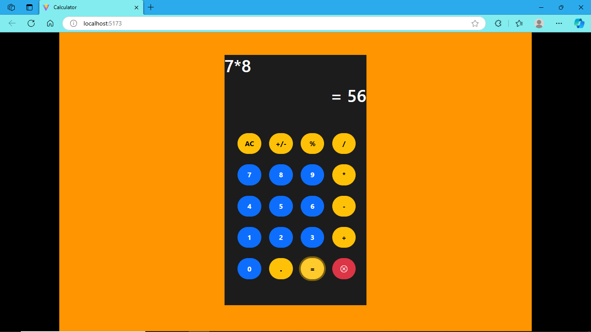

# Calculator App Using React JS

This is the beautiful, simple yet elegant calculator application which is build using Web Technologies such as React JS and Bootstrap

## Output ScreenShot

## To run the project

### Clone `https://github.com/Jeromed28/React-Calculator.git`  

`cd React-Calculator`    
`npm install`    
`npm run dev`
